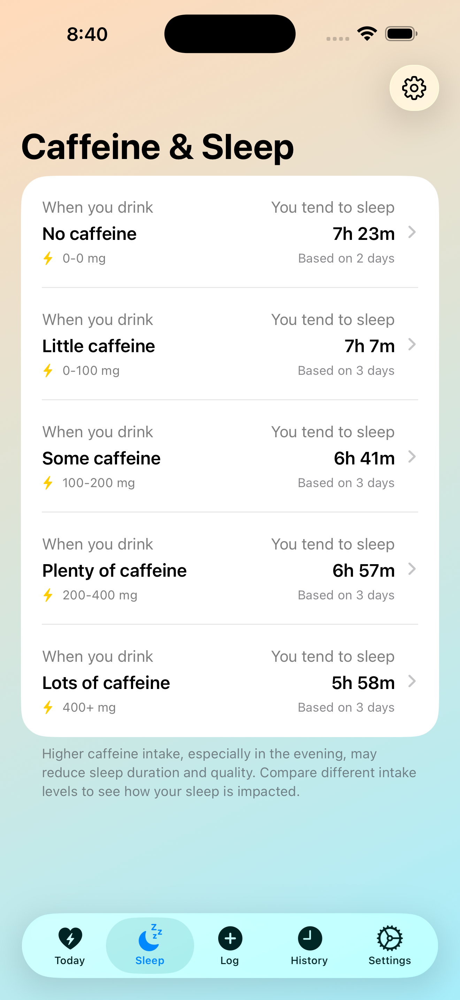
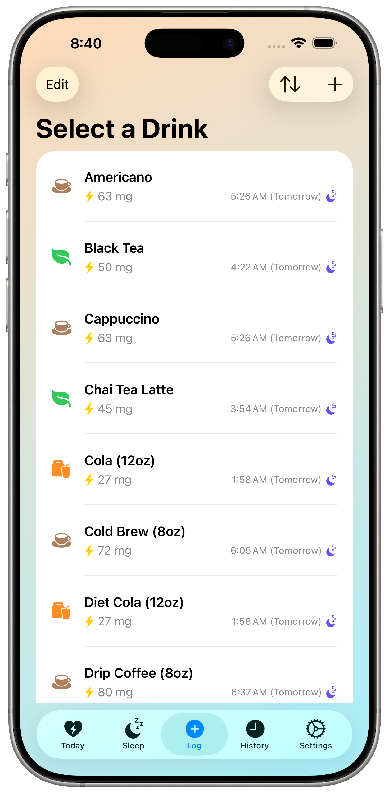
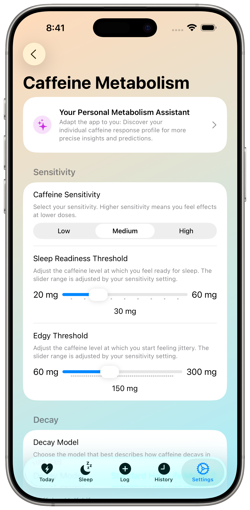

# Mindful Coffee: Caffeine Log & Cortisol Rhythm

**Track your caffeine, visualize your cortisol rhythm, and optimize your energy & sleep.**

Mindful Coffee is a smart iOS app designed to help you monitor your daily caffeine intake and discover its deep connection to your body's natural energy curve. Log your coffee, tea, and other caffeinated drinks to gain valuable insights into your **cortisol rhythm**, sleep patterns, and overall well-being. Empower yourself to make smarter choices for more restful nights and productive, focused days.

Beautifully designed with Apple's **Liquid Glass** aesthetic in mind, Mindful Coffee looks fantastic on your latest iPhone with its modern, translucent interface elements and smooth animations that feel right at home in iOS.

## ✨ Key Features

* **Effortless & Detailed Logging:** Quickly record your caffeine consumption with a user-friendly interface. After logging, you're brought back to the "Today" screen for an immediate overview. Customize your beverage list with:
    * **Smart Sorting Options:** Sort your drink list by "Last Used" or "Most Used" for even faster logging.
* **NEW! Cortisol Rhythm Modeling:** See your body's natural energy curve (the Cortisol Awakening Response or CAR) to optimize your caffeine timing for better focus and well-being. Understand how each drink impacts this vital rhythm.
* **Intelligent Sleep Prediction:** See a real-time estimate of when your caffeine levels will be low enough for quality sleep based on your intake and personalized settings.
* **"What-If" Scenarios:** Instantly preview how an additional drink might affect your predicted sleep time *before* you consume it, right from the drink selection list.
* **Personal Metabolism Assistant:** Answer a series of guided questions about your caffeine experiences. The assistant then analyzes your responses to suggest personalized values for your sensitivity, half-life, and thresholds, helping you fine-tune the app for maximum accuracy.
* **Personalized Metabolism & Cortisol Model:** Tailor caffeine and cortisol calculations precisely to your body with adjustable settings for half-life, sensitivity, sleep thresholds, and now, the core parameters of your cortisol curve.
* **Sleep Correlation Insights:** Analyze how different daily caffeine amounts correlate with your sleep duration imported from Apple Health, with customizable caffeine amount thresholds for more meaningful personal insights.
* **Smart Daily Log Reminder (Optional):** Receive a gentle nudge only on days you haven't logged any caffeine yet.
* **HealthKit Integration:**
    * **Write** caffeine consumption and drink volume (as water) automatically to Apple Health.
    * **Read** sleep analysis data for deeper correlations and insights.
    * **Optional Import:** Import previously logged 3rd party caffeine data from Apple Health.
* **Data Management:** **Import** and **Export** your complete consumption history via CSV files.
* **Customizable:** Set preferred bedtimes and choose your favorite app theme (System, Day, Night).

## 📱 Screenshots

<table>
<tr>
<td width="50%">

### ☕ Real-Time Caffeine & Cortisol Tracking
Visualize your caffeine decay curve alongside your body's natural cortisol rhythm. The intelligent assistant provides personalized recommendations for optimal caffeine timing to maximize energy and minimize sleep disruption.


</td>
<td width="50%">

### 📊 Data-Driven Sleep Insights
Analyze how your caffeine intake affects sleep quality across different consumption levels. Track correlations between daily caffeine amounts and sleep duration with personalized thresholds for meaningful insights.



</td>
</tr>
<tr>
<td width="50%">

### ⚡ Quick Logging with Smart Predictions
Log your coffee, tea, or energy drinks instantly with an intuitive interface. See real-time predictions of how each beverage will affect your sleep readiness before you drink it.



</td>
<td width="50%">

### 🧬 Personal Metabolism Assistant
Customize the app to match your unique caffeine metabolism. Adjust sensitivity, half-life, sleep thresholds, and cortisol parameters for precise tracking tailored to your body's response.



</td>
</tr>
</table>

## 🚀 Get the App

Download Mindful Coffee now and take control of your caffeine habits:
👉 [**Available on the App Store**](https://apps.apple.com/us/app/mindful-coffee-tracks-caffeine/id6742878005?platform=iphone)

## 🔬 Research & Collaboration

The cortisol modeling feature in this app is grounded in established scientific principles from chronobiology and longevity research. For a detailed overview of the underlying science, please see the [**Research Background document**](./RESEARCH_BACKGROUND.md).

I am actively interested in research collaborations. If you are a researcher or student working in a related field, please reach out to `support@alexloth.com`.

### Citing the App

If you use Mindful Coffee in your research, please cite it as follows:

```bibtex
@software{Loth2025MindfulCoffeeApp,
  author       = {Loth, Alexander},
  title        = {Mindful Coffee: Caffeine Log & Cortisol Rhythm},
  year         = {2025},
  version      = {4.5},
  publisher    = {Alexander Loth},
  url          = {https://apps.apple.com/us/app/mindful-coffee-tracks-caffeine/id6742878005}
}
```

## 🔒 Privacy

Your privacy is paramount. Your consumption data is stored securely and locally on your device using SwiftData. Any HealthKit data is accessed only with your explicit permission according to Apple's guidelines. **All** calculations, analysis, **and modeling run entirely locally on your device** and are never shared or sent to a server.

Read the full [Privacy Policy](https://github.com/aloth/mindful-coffee/blob/main/privacy_policy.md).

## 🌍 Localization

Mindful Coffee is available in English, German, Spanish, French, Chinese, and Japanese.

## 🛠️ Support & Feedback

We welcome your feedback and ideas! Help us make Mindful Coffee even better:

  * **Report a Bug**: [Open an Issue](https://github.com/aloth/mindful-coffee/issues/new?template=bug_report.md)
  * **Suggest a Feature**: [Open a Feature Request](https://github.com/aloth/mindful-coffee/issues/new?template=feature_request.md)

-----

Start tracking smarter and feel better with Mindful Coffee!

## 🚀 Get the App

Download Mindful Coffee now and take control of your caffeine habits:
👉 [**Available on the App Store**](https://apps.apple.com/us/app/mindful-coffee-tracks-caffeine/id6742878005?platform=iphone)

## 🔬 Research & Collaboration

The cortisol modeling feature in this app is grounded in established scientific principles from chronobiology and longevity research. For a detailed overview of the underlying science, please see the [**Research Background document**](./RESEARCH_BACKGROUND.md).

I am actively interested in research collaborations. If you are a researcher or student working in a related field, please reach out to `support@alexloth.com`.

### Citing the App

If you use Mindful Coffee in your research, please cite it as follows:

```bibtex
@software{Loth2025MindfulCoffeeApp,
  author       = {Loth, Alexander},
  title        = {Mindful Coffee: Caffeine Log & Cortisol Rhythm},
  year         = {2025},
  version      = {4.5},
  publisher    = {Alexander Loth},
  url          = {[https://apps.apple.com/us/app/mindful-coffee-tracks-caffeine/id6742878005](https://apps.apple.com/us/app/mindful-coffee-tracks-caffeine/id6742878005)}
}
````

## 🔒 Privacy

Your privacy is paramount. Your consumption data is stored securely and locally on your device using SwiftData. Any HealthKit data is accessed only with your explicit permission according to Apple's guidelines. **All** calculations, analysis, **and modeling run entirely locally on your device** and are never shared or sent to a server.

Read the full [Privacy Policy](https://github.com/aloth/mindful-coffee/blob/main/privacy_policy.md).

## 🌍 Localization

Mindful Coffee is available in English, German, Spanish, French, Chinese, and Japanese.

## 🛠️ Support & Feedback

We welcome your feedback and ideas\! Help us make Mindful Coffee even better:

  * **Report a Bug**: [Open an Issue](https://github.com/aloth/mindful-coffee/issues/new?template=bug_report.md)
  * **Suggest a Feature**: [Open a Feature Request](https://github.com/aloth/mindful-coffee/issues/new?template=feature_request.md)

-----

Start tracking smarter and feel better with Mindful Coffee\!
