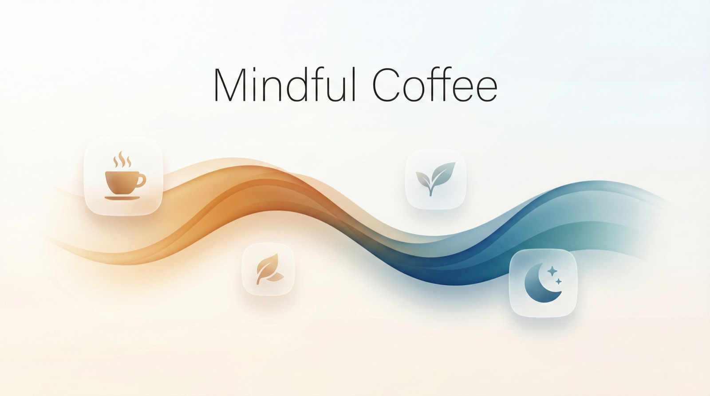

# Mindful Coffee - Caffeine Tracker App for iPhone with Sleep Prediction & Cortisol Rhythm

<p align="center">
  
</p>

**The smartest way to track caffeine, predict your sleep, and optimize your energy throughout the day.**

Stop guessing when you'll be ready for bed. Mindful Coffee is a beautifully designed iOS app that tracks your coffee, tea, and energy drink consumption while showing you exactly when caffeine will clear your system for quality sleep. Understand your body's natural cortisol rhythm and time your caffeine perfectly for peak performance.

Built with Apple's stunning **Liquid Glass** design language, Mindful Coffee feels right at home on your iPhone with its modern translucent interface and buttery-smooth animations.

## Why Mindful Coffee?

Most caffeine trackers just count milligrams. Mindful Coffee goes deeper - it models your personal metabolism, visualizes your cortisol awakening response, and predicts your optimal sleep time based on real science. Whether you're a coffee enthusiast optimizing your morning routine or someone trying to improve sleep quality, this app gives you the insights you need.

## Key Features

**Track Smarter, Sleep Better**

- **Daily Logging Streaks** - Stay motivated with visual streak counters that celebrate your consistency
- **Caffeine-Free Day Tracking** - Log intentional caffeine-free days to maintain your streak while taking mindful breaks
- **Sleep Insights Card** - See last night's sleep duration and caffeine impact at a glance
- **Grouped History View** - Browse your consumption history with the current month expanded and past months neatly summarized

**Intelligent Caffeine Tracking**

- **One-Tap Logging** - Record coffee, tea, energy drinks, and custom beverages instantly
- **Smart Sorting** - Sort your drink list by "Last Used" or "Most Used" for faster logging
- **Real-Time Sleep Prediction** - Know exactly when you'll be ready for quality sleep based on your intake
- **What-If Simulator** - Preview how another drink would affect your sleep time before you consume it

**Personalized to Your Body**

- **Personal Metabolism Quiz** - Answer guided questions to calibrate sensitivity, half-life, and sleep thresholds
- **AI Insights (Pro)** - Get personalized caffeine commentary powered by Apple Intelligence. Context-aware messages adapt to your energy levels, time of day, and sleep patterns - all processed entirely on-device. The AI research foundation is based on the [JudgeGPT project](https://github.com/aloth/JudgeGPT). *(Requires iPhone 15 Pro or iPhone 16 series, iPad Air/Pro with M1+, iPad mini with A17 Pro, or Mac with Apple Silicon, running iOS 18.1+, iPadOS 18.1+, or macOS 15.1+)*
- **Cortisol Rhythm Modeling** - Visualize your body's natural energy curve and optimize caffeine timing
- **Sleep Correlation Analysis** - Discover how caffeine levels affect your actual sleep duration using Apple Health data

**Seamless Apple Integration**

- **HealthKit Sync** - Automatically log caffeine to Apple Health and import sleep data for deeper insights
- **Import from Other Apps** - Bring in caffeine data from third-party apps via HealthKit
- **iCloud Sync** - Seamlessly sync your caffeine data across iPhone, iPad, and Mac
- **CSV Export** - Full data ownership with complete history export

## Screenshots

<table>
<tr>
<td width="50%">

### Real-Time Caffeine & Cortisol Tracking
Visualize your caffeine decay curve alongside your body's natural cortisol rhythm. The intelligent assistant provides personalized recommendations for optimal caffeine timing.


</td>
<td width="50%">

### Data-Driven Sleep Insights
Analyze how your caffeine intake affects sleep quality across different consumption levels. Track correlations between daily caffeine and sleep duration with personalized thresholds.


</td>
</tr>
<tr>
<td width="50%">

### Quick Logging with Smart Predictions
Log your coffee, tea, or energy drinks instantly. See real-time predictions of how each beverage will affect your sleep readiness before you drink it.


</td>
<td width="50%">

### Personal Metabolism Calibration
Customize the app to match your unique caffeine metabolism. Adjust sensitivity, half-life, sleep thresholds, and cortisol parameters for precise tracking tailored to your body.


</td>
</tr>
</table>

## Download Now

Take control of your caffeine habits and sleep better tonight:

[](https://apps.apple.com/us/app/mindful-coffee-tracks-caffeine/id6742878005?platform=iphone)

[**Visit the Official Website**](http://mindfulcoffee.alexloth.com) - Learn more about features, the science behind it, and latest updates

---

## The Science Behind Mindful Coffee

The cortisol modeling feature is grounded in established research from chronobiology and longevity science. For a detailed look at the underlying science, see the [**Research Background**](./RESEARCH_BACKGROUND.md).

**Interested in research collaboration?** If you're a researcher or student working in chronobiology, sleep science, or related fields, reach out at `support+mindfulcoffee@alexloth.com`.

### Citing the App

```bibtex
@software{Loth2025MindfulCoffeeApp,
  author       = {Loth, Alexander},
  title        = {Mindful Coffee: Caffeine Log & Cortisol Rhythm},
  year         = {2025},
  version      = {5.4},
  publisher    = {Alexander Loth},
  url          = {https://apps.apple.com/us/app/mindful-coffee-tracks-caffeine/id6742878005}
}
```

## Privacy First

Your data stays on your device — or syncs securely via your personal iCloud account. Mindful Coffee stores all consumption data locally using SwiftData, with optional iCloud sync across your Apple devices. HealthKit access requires your explicit permission following Apple guidelines. **All calculations, analysis, AI insights, and modeling run entirely on-device** - nothing is ever sent to a server.

Read the full [Privacy Policy](https://github.com/aloth/mindful-coffee/blob/main/privacy_policy.md).

## FAQ & Support

Questions about caffeine science, app features, or troubleshooting? Check out the comprehensive FAQ:

[**Frequently Asked Questions**](./FAQ.md)

Also available in: [Deutsch](./FAQ_de.md) | [Español](./FAQ_es.md) | [Français](./FAQ_fr.md) | [日本語](./FAQ_ja.md) | [简体中文](./FAQ_zh-Hans.md)

## Available Languages

Mindful Coffee is fully localized in English, German, Spanish, French, Japanese, and Simplified Chinese.

**README in other languages:**
[Deutsch](./README_de.md) | [Español](./README_es.md) | [Français](./README_fr.md) | [日本語](./README_ja.md) | [简体中文](./README_zh-Hans.md)

---

## Feedback & Support

Help make Mindful Coffee even better:

- **Report a Bug**: [Open an Issue](https://github.com/aloth/mindful-coffee/issues/new?template=bug_report.md)
- **Suggest a Feature**: [Open a Feature Request](https://github.com/aloth/mindful-coffee/issues/new?template=feature_request.md)

---

**Track smarter. Sleep better. Feel your best with Mindful Coffee.**

[](https://apps.apple.com/us/app/mindful-coffee-tracks-caffeine/id6742878005?platform=iphone)

[Visit Website](http://mindfulcoffee.alexloth.com)
