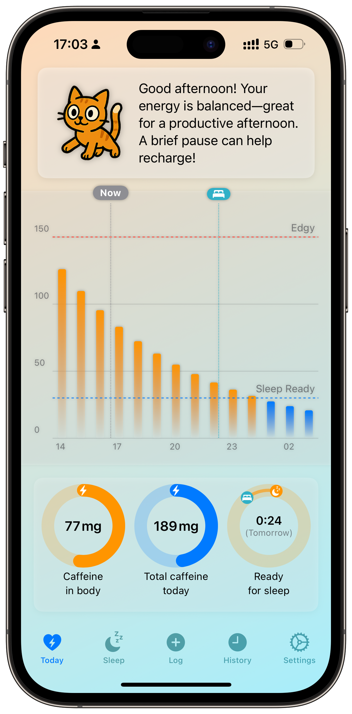
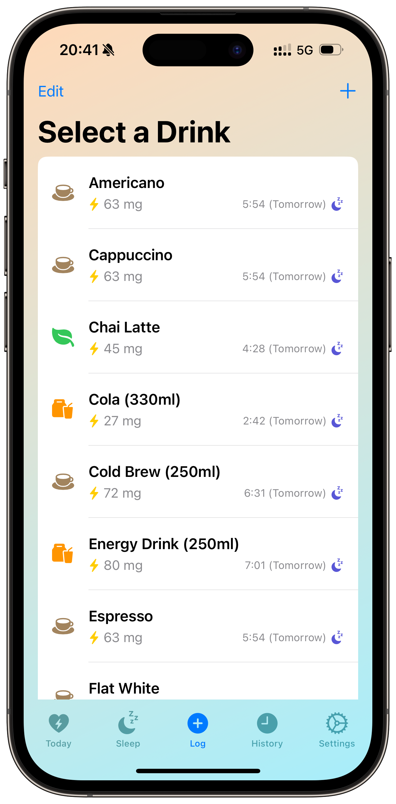
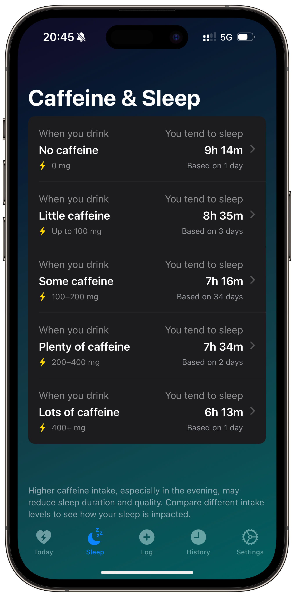

# Mindful Coffee ☕  

**Smartly track your caffeine, understand its impact, and optimize your energy & sleep.**

Mindful Coffee is a smart iOS app designed to help you monitor your daily caffeine intake and discover how it affects your body. Log your coffee, tea, and other caffeinated drinks to gain valuable insights into your energy levels, sleep patterns, and overall well-being. Empower yourself to make smarter choices for more restful nights and productive days.

## ✨ Key Features

*   **Effortless Logging:** Quickly record your caffeine consumption with a user-friendly interface and a customizable list of drinks.
*   **Intelligent Sleep Prediction:** See a real-time estimate of when your caffeine levels will be low enough for quality sleep based on your intake and personalized settings.
*   **"What-If" Scenarios:** Instantly preview how an additional drink might affect your predicted sleep time *before* you consume it, right from the drink selection list.
*   **Personalized Metabolism:** Tailor caffeine decay calculations precisely to your body with adjustable:
    *   **Caffeine Sensitivity** (Low, Medium, High).
    *   **Sleep Readiness Threshold** (the caffeine level where you feel ready for sleep).
    *   **Edgy Threshold** (the level where you might start feeling jittery).
    *   **Caffeine Half-Life** (how quickly your body processes caffeine).
    *   **Delay Before Decay** (accounts for absorption time).
    *   Multiple **Decay Models** (e.g., Standard Half-Life, Linear).
    *   **Maximum Daily Intake** limit.
*   **Smart Reminders (Optional):** Receive a gentle nudge only on days you haven't logged any caffeine yet.
*   **Sleep Correlation Insights:** Analyze how different daily caffeine amounts correlate with your sleep duration imported from Apple Health.
*   **HealthKit Integration:**
    *   **Write** caffeine consumption automatically to Apple Health.
    *   **Read** sleep analysis data for deeper correlations and insights.
*   **Data Management:** **Import** and **Export** your complete consumption history via CSV files.
*   **Customizable:** Set preferred bedtimes and choose your favorite app theme (System, Day, Night).

## 📱 Screenshots

Here's a glimpse of Mindful Coffee in action:

  
   <em>The main 'Today' screen features Coffee Cat, visualizes caffeine decay on a chart, shows your current estimated caffeine level, daily total, and predicts when you'll be ready for sleep.</em>

  
   <em>Quickly select a drink from your customizable list. Each option instantly shows its caffeine level and a <strong>smart preview</strong> of how it might affect your sleep if consumed now.</em>

  
   <em>Analyze your personal trends on the Caffeine & Sleep screen. See how different levels of daily caffeine intake correlate with your average sleep duration, based on your logged data and HealthKit sleep analysis.</em>

## 🚀 Get the App

Download Mindful Coffee now and take control of your caffeine habits:
👉 [**Available on the App Store**](https://apps.apple.com/us/app/mindful-coffee-tracks-caffeine/id6742878005?platform=iphone)

## 🔒 Privacy

Your privacy is paramount. Your consumption data is stored securely and locally on your device using SwiftData. Any HealthKit data is accessed only with your explicit permission according to Apple's guidelines. **All calculations, analysis, and any machine learning routines run entirely locally on your device** and are never shared or sent to a server.

Read the full [Privacy Policy](https://github.com/aloth/mindful-coffee/blob/main/privacy_policy.md).

## 🌍 Localization

Mindful Coffee is available in English, German, Spanish, French, Chinese, and Japanese.

## 🛠️ Support & Feedback

We welcome your feedback and ideas! Help us make Mindful Coffee even better:

*   **Report a Bug**: [Open an Issue](https://github.com/aloth/mindful-coffee/issues/new?template=bug_report.md)
*   **Suggest a Feature**: [Open a Feature Request](https://github.com/aloth/mindful-coffee/issues/new?template=feature_request.md)

---

Start tracking smarter and feel better with Mindful Coffee!
