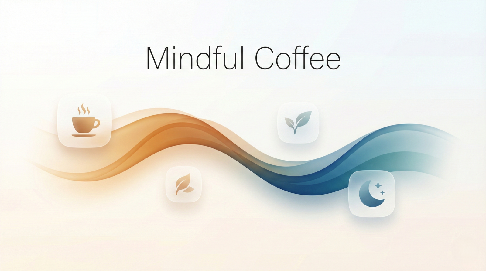
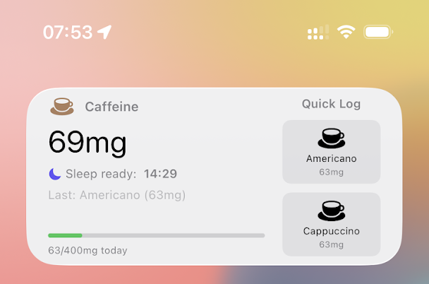
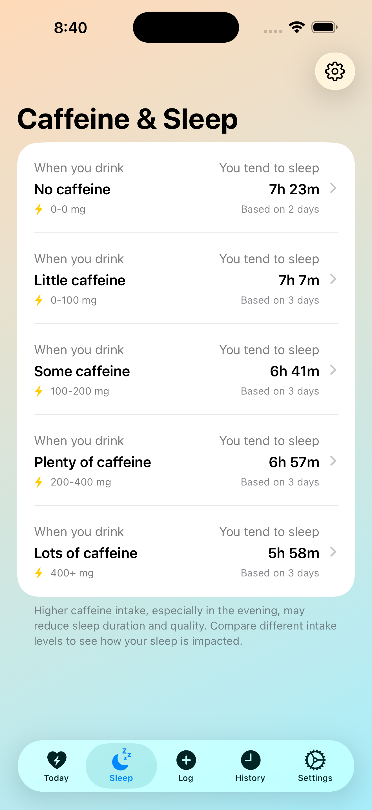
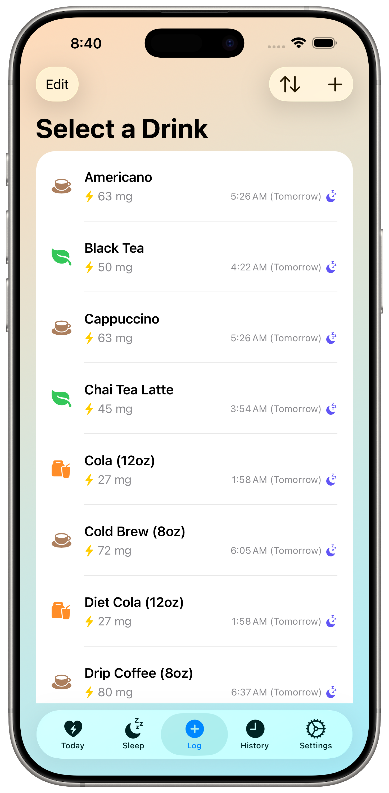
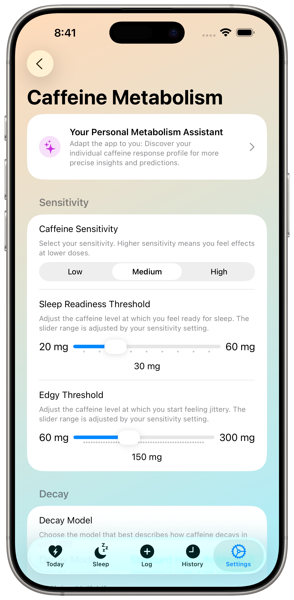

🇺🇸 [English](README.md) | 🇩🇪 [Deutsch](README_de.md) | 🇪🇸 [Español](README_es.md) | 🇫🇷 **Français** | 🇯🇵 [日本語](README_ja.md) | 🇨🇳 [中文](README_zh-Hans.md)

# Mindful Coffee - App de suivi de caféine pour iPhone avec prédiction du sommeil et rythme du cortisol

<p align="center">
  
</p>

**La manière la plus intelligente de loguer chaque espresso, V60, AeroPress, cold brew ou matcha — réglez votre tasse parfaite, suivez votre caféine et prédisez votre sommeil.**

Mindful Coffee est une app iOS magnifiquement conçue qui combine un **Journal de café** complet (espresso, V60, AeroPress, Chemex, French press, moka, cold brew, thé, matcha, Gong Fu) avec un suivi intelligent de la caféine et du sommeil. Capturez mouture, dose, ratio, temps, température et note dans un flux élégant, voyez quand la caféine quittera votre système et comprenez le rythme naturel de cortisol de votre corps.

Conçue avec le superbe langage de design **Liquid Glass** d'Apple, Mindful Coffee se sent chez elle sur votre iPhone : interface translucide moderne et animations d'une fluidité parfaite.

## Pourquoi Mindful Coffee ?

La plupart des trackers de caféine ne comptent que les milligrammes. La plupart des apps café ne stockent que des recettes. Mindful Coffee fait les deux — la seule app iOS qui réunit un Journal de café complet avec un modèle personnel de métabolisme de la caféine et une prédiction du sommeil sur l'appareil. Que vous chassiez l'espresso parfait, régliez un V60 ou cherchiez simplement à mieux dormir.

## Nouveautés 5.6 — Journal de café (Pro)

- **Loguez chaque extraction** — Espresso, V60, AeroPress, Chemex, French press, moka, cold brew — plus thé, matcha et Gong Fu. Mouture, dose, ratio, temps, température et note dans un flux élégant.
- **Guide d'extraction** — Recettes intégrées pour chaque méthode. Touchez pour démarrer, ou enregistrez votre tasse parfaite.
- **Suggestions intelligentes** — Ajustez mouture, temps et température selon vos cafés précédents. Calez plus vite, gaspillez moins.
- **Analyse de café** — Note moyenne, votre meilleur café, et ce que « réglé » signifie pour vous.
- **Minuteur en direct** — Précision mm:ss avec sélecteur dédié au cold brew et prise en charge Gong Fu.
- **Le thé bien fait** — Estimation intelligente de la caféine par feuille et méthode (vert, noir, oolong, blanc, herbal, matcha).

## Fonctionnalités principales

**Suivez mieux, dormez mieux**

- **Séries de jours consécutifs** - Restez motivé avec des compteurs visuels qui célèbrent votre régularité
- **Suivi des journées sans caféine** - Enregistrez vos journées intentionnellement sans caféine pour maintenir votre série tout en prenant des pauses conscientes
- **Carte d'insights sommeil** - Voyez d'un coup d'œil la durée de votre sommeil hier soir et l'impact de la caféine
- **Historique groupé** - Parcourez votre historique avec le mois en cours développé et les mois passés résumés

**Suivi intelligent de la caféine**

- **Enregistrement en un tap** - Enregistrez café, thé, boissons énergisantes et boissons personnalisées instantanément
- **Tri intelligent** - Triez votre liste par "Dernièrement utilisé" ou "Plus utilisé" pour un logging plus rapide
- **Prédiction du sommeil en temps réel** - Sachez exactement quand vous serez prêt pour un sommeil de qualité
- **Simulateur "Et si..."** - Prévisualisez comment une autre boisson affecterait votre heure de coucher avant de la consommer

**Personnalisé pour votre corps**

- **Quiz métabolisme personnel** - Répondez à des questions guidées pour calibrer sensibilité, demi-vie et seuils de sommeil
- **Informations IA (Pro)** - Obtenez des commentaires personnalisés sur la caféine avec Apple Intelligence. Messages contextuels qui s'adaptent à votre niveau d'énergie, l'heure de la journée et vos habitudes de sommeil - tout traité entièrement sur l'appareil. La base de recherche IA est fondée sur le [projet JudgeGPT](https://github.com/aloth/JudgeGPT). *(Nécessite iPhone 15 Pro ou iPhone 16, iPad Air/Pro avec M1+, iPad mini avec A17 Pro, ou Mac avec Apple Silicon, iOS 18.1+, iPadOS 18.1+ ou macOS 15.1+)*
- **Modélisation du rythme de cortisol** - Visualisez la courbe d'énergie naturelle de votre corps et optimisez le timing de votre caféine
- **Analyse de corrélation avec le sommeil** - Découvrez comment les niveaux de caféine affectent votre durée de sommeil réelle grâce aux données Apple Santé

**Widgets d'écran d'accueil et de verrouillage**




- **Caféine en un coup d'œil** - Consultez votre niveau de caféine, consommation quotidienne et heure de sommeil prévue directement sur l'écran d'accueil
- **Widgets d'écran de verrouillage** - Styles circulaire, rectangulaire et inline pour vérifier votre caféine sans déverrouiller
- **Enregistrement rapide depuis le widget** - Enregistrez votre boisson la plus récente ou la plus consommée en un geste depuis l'écran d'accueil
- **Personnalisation du widget (Pro)** - Personnalisez les boutons d’enregistrement rapide et choisissez des styles modernes comme Midnight, Warm Latte, Focus Blue et Forest
- **Widget moyen** - Affiche vos boissons préférées pour un enregistrement instantané

**Intégration Apple parfaite**

- **Synchronisation HealthKit** - Enregistrez automatiquement la caféine dans Apple Santé et importez les données de sommeil pour des insights approfondis
- **Import depuis d'autres apps** - Récupérez les données de caféine d'apps tierces via HealthKit
- **Synchronisation iCloud** - Synchronisez vos données de caféine entre iPhone, iPad et Mac
- **Export CSV** - Propriété totale de vos données avec export complet de l'historique

## Captures d'écran

<table>
<tr>
<td width="50%">

### Suivi en temps réel : caféine et cortisol
Visualisez votre courbe de décroissance de caféine superposée au rythme naturel de cortisol. L'assistant intelligent fournit des recommandations personnalisées pour un timing optimal de la caféine.


</td>
<td width="50%">

### Insights sommeil basés sur les données
Analysez comment votre consommation de caféine affecte la qualité du sommeil à différents niveaux. Suivez les corrélations entre quantité quotidienne de caféine et durée de sommeil avec des seuils personnalisés.



</td>
</tr>
<tr>
<td width="50%">

### Enregistrement rapide avec prédictions intelligentes
Enregistrez votre café, thé ou boisson énergisante en un instant. Voyez en temps réel comment chaque boisson affectera votre capacité à vous endormir, avant même de la boire.



</td>
<td width="50%">

### Calibration du métabolisme personnel
Adaptez l'application à votre métabolisme unique de la caféine. Ajustez sensibilité, demi-vie, seuils de sommeil et paramètres de cortisol pour un suivi précis taillé sur mesure pour votre corps.



</td>
</tr>
</table>

## Télécharger maintenant

Prenez le contrôle de vos habitudes de caféine et dormez mieux ce soir :

[](https://apps.apple.com/fr/app/mindful-coffee-tracks-caffeine/id6742878005?platform=iphone)

[**Visiter le site officiel**](http://mindfulcoffee.alexloth.com) - En savoir plus sur les fonctionnalités, la science et les dernières mises à jour

---

## La science derrière Mindful Coffee

Le modèle de cortisol est basé sur des recherches établies en chronobiologie et science de la longévité. Pour un aperçu détaillé des fondements scientifiques, consultez le [**Research Background**](./RESEARCH_BACKGROUND.md) (en anglais).

**Intéressé par une collaboration de recherche ?** Si vous êtes chercheur ou étudiant travaillant en chronobiologie, science du sommeil ou domaines connexes, contactez-nous à `support+mindfulcoffee@alexloth.com`.

### Citer l'application

```bibtex
@software{Loth2025MindfulCoffeeApp,
  author       = {Loth, Alexander},
  title        = {Mindful Coffee: Caffeine Log & Cortisol Rhythm},
  year         = {2025},
  version      = {5.6},
  publisher    = {Alexander Loth},
  url          = {https://apps.apple.com/fr/app/mindful-coffee-tracks-caffeine/id6742878005}
}
```

## Confidentialité avant tout

Vos données restent sur votre appareil — ou se synchronisent en toute sécurité via votre compte iCloud personnel. Mindful Coffee stocke toutes les données de consommation localement via SwiftData, avec synchronisation iCloud optionnelle sur tous vos appareils Apple. L'accès à HealthKit nécessite votre autorisation explicite conformément aux directives Apple. **Tous les calculs, analyses, informations IA et modélisations s'exécutent entièrement sur l'appareil** - rien n'est jamais envoyé à un serveur.

Lisez la [Politique de Confidentialité](https://github.com/aloth/mindful-coffee/blob/main/privacy_policy.md) complète.

## FAQ et support

Questions sur la science de la caféine, les fonctionnalités de l'app ou le dépannage ? Consultez la FAQ complète :

[**Foire aux questions**](./FAQ_fr.md)

Également disponible en : [English](./FAQ.md) | [Deutsch](./FAQ_de.md) | [Español](./FAQ_es.md) | [日本語](./FAQ_ja.md) | [简体中文](./FAQ_zh-Hans.md)

## Langues disponibles

Mindful Coffee est entièrement localisée en anglais, allemand, espagnol, français, japonais et chinois simplifié.

**README dans d'autres langues :**
[English](./README.md) | [Deutsch](./README_de.md) | [Español](./README_es.md) | [日本語](./README_ja.md) | [简体中文](./README_zh-Hans.md)

---

## Feedback et support

Aidez-nous à améliorer Mindful Coffee :

- **Signaler un bug** : [Ouvrir une Issue](https://github.com/aloth/mindful-coffee/issues/new?template=bug_report.md)
- **Suggérer une fonctionnalité** : [Ouvrir une Feature Request](https://github.com/aloth/mindful-coffee/issues/new?template=feature_request.md)

---

**Suivez mieux. Dormez mieux. Donnez le meilleur de vous-même avec Mindful Coffee.**

[Télécharger sur l'App Store](https://apps.apple.com/fr/app/mindful-coffee-tracks-caffeine/id6742878005?platform=iphone) | [Visiter le site](http://mindfulcoffee.alexloth.com)
